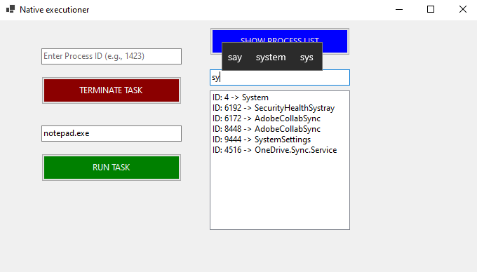

# Native System Task Manager 🚀

A zero-dependency, native Windows OS utility built entirely from scratch in C# to monitor, filter, and execute system processes.

## 🧠 The Architecture & "The Why"
I built this project to fix my engineering foundation. I realized I was relying too heavily on web frameworks, so I stepped back to build something that communicates directly with the operating system on bare metal. 

Instead of bloated wrappers, this tool uses raw C# and `System.Diagnostics` to interact with the Windows Kernel, wrapped in a lightweight, native WinForms UI.

## ✨ Core Features
* **Live Kernel Monitoring:** Fetches active system processes directly from the OS.
* **Real-Time Memory Filtering:** Custom LINQ-based search engine that filters processes instantly on every keystroke without querying the kernel twice.
* **Process Executioner:** Safely terminates target applications via Process IDs (PIDs) with built-in `Win32Exception` handling.
* **Executable Launcher:** Instantiates new native applications directly from the custom UI.

## 💻 Tech Stack
* **Language:** C#
* **Framework:** .NET (WinForms)
* **OS Interop:** `System.Diagnostics`
* **State Management:** In-Memory Master Lists

## 🚀 How to Run (No Install Required)
You do not need to install .NET or any dependencies to run this tool. 
1. Go to the **Releases** tab on the right side of this repository.
2. Download the `NativeTaskManager.exe` file.
3. Double-click to run. (It is a self-contained executable).